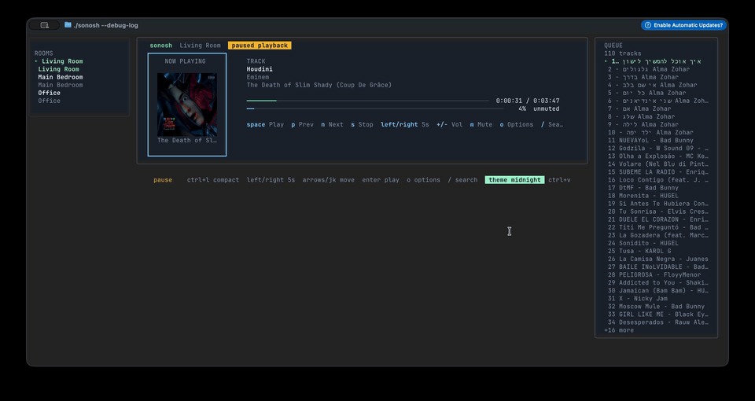

# sonosh - Sonos TUI and CLI



## sonosh TUI

`sonosh` is the keyboard-driven terminal UI in this repo: a Go application for
discovering Sonos speakers, selecting a room, and controlling playback without
leaving the terminal. The `sonos` CLI and shared backend it builds on are still
in this repository, but they are described separately below so the TUI-specific
feature set is clear.

- **Room-aware dashboard**: discover speakers and groups, pick the active room,
  and keep live now-playing, transport, volume, mute, and playback-mode state
  in one screen.
- **Keyboard-first playback control**: play, pause, stop, next, previous,
  volume up/down, mute toggle, and short scrubbing jumps directly from the UI.
- **Playback-mode controls**: inspect and toggle shuffle, repeat, and
  crossfade without dropping to a separate command.
- **Queue management**: open a live queue pane, page through entries, play a
  specific position, remove items, move entries, and clear the queue.
- **Spotify / SMAPI search**: search tracks or playlists from Sonos music
  services, preview playlist contents, and start playback from search results.
- **Playlist carousel**: keep pinned playlist shortcuts plus recent playlist
  results in a persistent carousel, with artwork preserved in the UI.
- **Album-art rendering**: show cover art inline in the player pane with
  terminal-friendly fallbacks when richer rendering is unavailable.
- **Adaptive layouts and themes**: switch visual themes, use a compact layout
  on narrower terminals, and persist those preferences across launches.
- **Optional macOS media bridge**: `sonosh` can launch the Swift helper in
  `helpers/macos/sonosh-helper`, publish now-playing metadata to the system
  media layer, and bind hardware or Control Center play/pause, toggle, next,
  and previous commands back into the app over a local Unix-socket JSON
  protocol.

`sonosh` is a Go terminal UI for discovering and controlling Sonos speakers on
your local network. It is fork-derived from
[`steipete/sonoscli`](https://github.com/steipete/sonoscli), keeping the mature
Sonos discovery/control internals while adding a Bubble Tea TUI.

The `sonosh` TUI currently supports:

- room discovery and room selection
- now-playing, volume, and mute status
- play/pause, stop, next, previous, volume, and mute controls
- Spotify/SMAPI search through linked Sonos music services

The inherited `sonos` CLI is still available while the TUI grows.

`sonoscli` is a modern Go CLI to control Sonos speakers over your local network (UPnP/SOAP).

## sonoscli Lineage

The sections from here down describe the inherited `sonos` CLI surface and the
shared Sonos backend capabilities that `sonosh` builds on.

- **Reliable discovery**: SSDP + topology (`ZoneGroupTopology.GetZoneGroupState`) with subnet scan fallback.
- **Coordinator-aware control**: target any room; commands go to the group coordinator automatically.
- **Playback controls**: play/pause/stop/next/prev, plus `play-uri`, `linein`, and `tv`.
- **Grouping**: inspect groups, join/unjoin, party mode, dissolve groups, and **solo** a room.
- **Queue**: list/play/remove/clear queue entries.
- **Favorites**: list and play Sonos Favorites by index or title.
- **Scenes**: save/apply presets (grouping + per-room volume/mute).
- **Spotify**:
  - Enqueue/play Spotify share links or canonical `spotify:<type>:<id>` URIs (no Spotify credentials required).
  - Search Spotify via **SMAPI** (Sonos Music API; uses your linked service in Sonos).
  - Optional Spotify Web API search (client credentials) if you want it.
- **YouTube handoff**: resolve a YouTube URL with `yt-dlp` and hand the direct audio stream to Sonos.
- **Smart URL streaming**: `play-url` runs a short-lived local MP3 proxy for YouTube, YouTube Music playlists, podcasts, radio streams, SoundCloud-style pages, and other URLs.
- **Live events**: `watch` subscribes to AVTransport + RenderingControl and prints changes.
- **Scriptable output**: `--format plain|json|tsv` plus `--debug` tracing.

This is not an official Sonos project.

## Requirements

- Your machine must be on the same network as your Sonos system.
- Speakers must be reachable on TCP port `1400` (e.g. `http://<speaker-ip>:1400/`).

Spotify:
- Spotify must already be linked in the Sonos app.
- This CLI does not authenticate with Spotify; it enqueues Sonos “Spotify” URIs/metadata.

Spotify search (recommended, no Spotify Web API credentials):
- `sonos smapi search` uses Sonos SMAPI to search linked services (e.g. Spotify).
- Some services require a one-time DeviceLink/AppLink flow: `sonos auth smapi begin|complete`.

Spotify search via Spotify Web API (optional):
- If you want `sonos search spotify`, you’ll need a Spotify Web API app (client credentials).
  Set `SPOTIFY_CLIENT_ID` and `SPOTIFY_CLIENT_SECRET` (or pass `--client-id/--client-secret`).

YouTube:
- Install `yt-dlp` if you want `sonos play youtube`.
- Sonos plays the resolved temporary audio stream directly; long videos may expire and need resolving again.
- For most YouTube playback, prefer `sonos play-url`: it proxies the stream through your machine, transcodes to MP3, and avoids Sonos having to fetch YouTube's temporary media URL itself.

Smart URL streaming:
- Install `yt-dlp` and `ffmpeg` for `sonos play-url`.
- `play-url` resolves common media pages, pipes `yt-dlp` sources into `ffmpeg`, transcodes to a local MP3 stream, sends the resolved title/provider to Sonos metadata, and exits the proxy when playback ends or goes idle.
- Unambiguous YouTube / YouTube Music playlist URLs (`?list=…` without `?v=…`) are auto-detected and enqueued track-by-track. Use `--playlist`, `--no-playlist`, and `--playlist-limit` to control playlist handling.

## Install / build

Install (Homebrew, single line):

```bash
brew install shlomiuziel/tap/sonosh
```

This installs the `sonosh` command globally. On macOS, the formula also builds
the Swift media helper and wires it up automatically so playback control keys
and now-playing metadata keep working without extra setup.

Upgrade later:

```bash
brew upgrade shlomiuziel/tap/sonosh
```

First-time Spotify setup:

- If you want Spotify / SMAPI search in `sonosh`, use the inherited `sonos` CLI: `sonos auth smapi begin --service "Spotify"` and finish the DeviceLink/AppLink flow.
- Use `sonos config set defaultRoom "<Room Name>"` and `sonos config set defaultTimeout 20s` if you want sticky defaults for the TUI and CLI.
- See [`docs/commands/sonos-auth-smapi.md`](docs/commands/sonos-auth-smapi.md) and [`docs/commands/sonos-config.md`](docs/commands/sonos-config.md) for the full command details.

Install from source (Go):

```bash
go install github.com/shlomiuziel/sonosh/cmd/sonosh@latest
sonosh
```

Build the TUI locally:

```bash
go build -o sonosh ./cmd/sonosh
./sonosh
```

Build the optional macOS media helper:

```bash
swift build --package-path helpers/macos/sonosh-helper --configuration release
./sonosh --mac-helper-path helpers/macos/sonosh-helper/.build/release/sonosh-macos-helper
```

Build the inherited CLI locally:

```bash
go build -o sonos ./cmd/sonos
./sonos --version
```

Useful TUI keys:

- `up`/`down` or `k`/`j`: move selection
- `space`: play/pause
- `s`: stop
- `n` / `p`: next / previous
- `+` / `-`: volume
- `m`: mute
- `/` or `tab`: search
- `enter`: search or play selected result
- `r`: refresh
- `q`: quit

Docker:

```bash
docker build -t sonoscli .
docker run --rm --network host -v "$PWD/.sonoscli:/data" sonoscli discover
```

Linux containers need `--network host` for SSDP/UPnP discovery. The image includes `ffmpeg`, `yt-dlp`, and `curl`.

## Quick start

Note: if you installed via Homebrew or `go install`, replace `./sonos` with `sonos`.

Discover speakers:

```bash
./sonos discover
./sonos discover --format json
./sonos discover --all # include invisible/bonded devices (advanced)
```

Show status (text or JSON):

```bash
./sonos status --name "Kitchen"
./sonos now --name "Kitchen"
./sonos status --name "Kitchen" --format json
```

Playback:

```bash
./sonos play --name "Kitchen"
./sonos pause --name "Kitchen"
./sonos stop --name "Kitchen"
./sonos next --name "Kitchen"
./sonos prev --name "Kitchen"
```

Watch live events (track/volume changes):

```bash
./sonos watch --name "Kitchen"
./sonos watch --name "Kitchen" --format json
./sonos watch --name "Kitchen" --format tsv
```

Note: this starts a local callback server for UPnP events; your OS firewall may prompt to allow incoming connections.

## Command overview

Run `sonos --help` for the full list. Most commonly used:

- Discovery & status: `discover`, `status`/`now`, `watch`
- Playback: `play`, `pause`, `stop`, `next`, `prev`, `open`, `enqueue`, `play-url`, `play-uri`, `linein`, `tv`
- Grouping: `group status`, `group join`, `group unjoin`, `group solo`, `group party`, `group dissolve`
- Queue: `queue list`, `queue play`, `queue remove`, `queue clear`
- Favorites: `favorites list`, `favorites open`
- Scenes: `scene save`, `scene apply`, `scene list`, `scene delete`
- Spotify search: `smapi search` (recommended), optional `search spotify` (Spotify Web API)

## Queue

List the queue:

```bash
./sonos queue list --name "Kitchen"
./sonos queue list --name "Kitchen" --format json
```

Play or remove a queue entry (positions are 1-based):

```bash
./sonos queue play --name "Kitchen" 1
./sonos queue remove --name "Kitchen" 3
```

Clear the queue:

```bash
./sonos queue clear --name "Kitchen"
```

## Scenes (presets)

Save a scene (grouping + per-room volume/mute):

```bash
./sonos scene save "Evening"
```

Apply a scene later:

```bash
./sonos scene apply "Evening"
```

List / delete scenes:

```bash
./sonos scene list
./sonos scene delete "Evening"
```

Scenes are stored in your user config dir as `sonoscli/scenes.json` (e.g. `~/.config/sonoscli/scenes.json` on macOS/Linux).

## Favorites

List Sonos Favorites:

```bash
./sonos favorites list --name "Kitchen"
./sonos favorites list --name "Kitchen" --format json
```

Play by index (from the list):

```bash
./sonos favorites open --name "Kitchen" --index 1
```

Or play by title (case-insensitive exact match):

```bash
./sonos favorites open --name "Kitchen" "BBC Radio 6 Music"
```

## Other sources

Play an arbitrary URI:

```bash
./sonos play-uri --name "Kitchen" "https://example.com/stream.mp3"
```

Play a URL through the Sonos-safe local proxy (requires `ffmpeg`; `yt-dlp` for YouTube and media pages):

```bash
./sonos play-url --name "Kitchen" "https://www.youtube.com/watch?v=-n_rdQIVahw"
./sonos play-url --name "Kitchen" "https://music.youtube.com/playlist?list=PL..."
./sonos play-url --name "Kitchen" --playlist-limit 10 "https://music.youtube.com/playlist?list=PL..."
./sonos play-url --name "Kitchen" "https://example.com/podcast/episode.mp3"
```

Force radio-style playback (useful for station-like streams):

```bash
./sonos play-uri --name "Kitchen" --radio --title "My Stream" "https://example.com/live.mp3"
```

Switch to line-in (optionally from another speaker):

```bash
./sonos linein --name "Kitchen" --from "Living Room"
```

Switch to TV input (soundbar):

```bash
./sonos tv --name "Living Room"
```

## Grouping

Show current groups:

```bash
./sonos group status
./sonos group status --all # include invisible/bonded devices (advanced)
```

Join `Bedroom` into `Living Room`’s group:

```bash
./sonos group join --name "Bedroom" --to "Living Room"
```

Room targeting supports fuzzy substring matching (and will suggest matches on ambiguity):

```bash
./sonos group join --name "Off" --to "Bar"     # "Office" joins "Bar"
./sonos group join --name "Bed" --to "Liv"     # "Bedroom" joins "Living Room"
```

Ungroup a speaker (make it standalone):

```bash
./sonos group unjoin --name "Bedroom"
```

Solo a speaker (ungroup its current group so it plays alone):

```bash
./sonos group solo --name "Office"
```

Party mode (join all visible speakers to a target group):

```bash
./sonos group party --to "Bar"
```

Dissolve a group (ungroup all members of the group):

```bash
./sonos group dissolve --name "Living Room"
```

Ungroup Office and play on Office only:

```bash
./sonos group solo --name "Office"
./sonos open --name "Office" "https://open.spotify.com/album/<id>"
```

Re-join a speaker back into another group:

```bash
./sonos group join --name "Office" --to "Bar"
```

Group volume / mute (affects the whole group):

```bash
./sonos group volume get --name "Living Room"
./sonos group volume set --name "Living Room" 25

./sonos group mute get --name "Living Room"
./sonos group mute toggle --name "Living Room"
```

Volume / mute:

```bash
./sonos volume get --name "Kitchen"
./sonos volume set --name "Kitchen" 25

./sonos mute get --name "Kitchen"
./sonos mute toggle --name "Kitchen"
```

## Targeting and groups

Target a speaker by:
- `--name "Kitchen"` (Sonos room name)
- `--ip 192.168.0.250` (speaker IP)

Most commands must be sent to the *group coordinator* (the device that owns transport state for the group). `sonoscli` resolves the coordinator automatically so commands behave like the Sonos app.

## Spotify

Search via Sonos (SMAPI; no Spotify Web API credentials):

```bash
./sonos smapi services
./sonos smapi categories --service "Spotify"
./sonos smapi browse --service "Spotify" --id root
./sonos auth smapi begin --service "Spotify"
# open the printed URL in a browser, link your account, then:
./sonos auth smapi complete --service "Spotify" --code <linkCode> --wait 5m

./sonos smapi search --service "Spotify" --category tracks "gareth emery"
./sonos smapi search --service "Spotify" --category tracks --open --name "Office" "gareth emery"
```

Some AppLink services only return a native app authentication URL and no device-link code. In that case, `auth smapi begin` prints the app URL and notes that `sonoscli` cannot complete token storage automatically.

Play from a search query (shortcut for SMAPI search + open):

```bash
./sonos play spotify --name "Office" "gareth emery"
./sonos play spotify --name "Office" --category albums "gareth emery"
```

SMAPI tokens are stored under your user config dir as `sonoscli/smapi_tokens.json` (e.g. `~/.config/sonoscli/smapi_tokens.json` on macOS/Linux).

Search via Spotify Web API (prints playable URIs):

```bash
export SPOTIFY_CLIENT_ID="..."
export SPOTIFY_CLIENT_SECRET="..."

./sonos search spotify --type track --limit 5 "daft punk harder better"
./sonos search spotify --type playlist "focus"
```

Open the first search result directly on Sonos:

```bash
./sonos search spotify --open --name "Kitchen" "miles davis so what"
```

Enqueue + play:

```bash
./sonos open --name "Kitchen" spotify:track:6NmXV4o6bmp704aPGyTVVG
./sonos open --name "Kitchen" https://open.spotify.com/track/6NmXV4o6bmp704aPGyTVVG
```

Enqueue only:

```bash
./sonos enqueue --name "Kitchen" spotify:playlist:37i9dQZF1DXcBWIGoYBM5M
```

Notes:
- The enqueue implementation tries Spotify Sonos service numbers `2311` and `3079` for compatibility.
- Use `--title` to override the queue display title for some entries.

## Dev workflow

### Makefile

```bash
make fmt
make test
make build
make lint
```

`make lint` requires `golangci-lint`:

```bash
brew install golangci-lint
# or:
go install github.com/golangci/golangci-lint/cmd/golangci-lint@latest
```

### pnpm helper scripts

This repo includes a minimal `package.json` so you can drive the workflow with `pnpm` (no Node dependencies required):

```bash
pnpm build
pnpm test
pnpm format
pnpm lint

pnpm sonos -- discover
pnpm sonos -- status --name "Kitchen"
pnpm sonos -- open --name "Kitchen" spotify:track:6NmXV4o6bmp704aPGyTVVG
pnpm sonos -- search spotify "miles davis so what"
pnpm sonos -- group status
pnpm sonos -- queue list --name "Kitchen"
```

CI runs: `gofmt` check, `go vet`, `go test`, and `golangci-lint`.

## Global flags

- `--ip <ip>`: target by IP
- `--name <name>`: target by speaker name (defaults to `sonos config defaultRoom` if set)
- `--timeout <duration>`: discovery/network timeout (default `15s`, configurable with `sonos config set defaultTimeout 10s`)
- `--format plain|json|tsv`: output format (defaults to `sonos config format` if set)
- `--json`: deprecated alias for `--format json`
- `--debug`: enable detailed trace logs (SSDP/topology/SOAP timings)

## Config (defaults)

Persist small local defaults so repeated commands stay terse:

```bash
./sonos config get
./sonos config set defaultRoom "Office"
./sonos config set defaultTimeout 10s
./sonos config set format json
./sonos config unset defaultRoom
```

Supported keys:

- `defaultRoom`: room used when `--name` / `--ip` is omitted.
- `defaultTimeout`: discovery/network timeout used when `--timeout` is omitted. The built-in default is `15s`.
- `format`: default output format (`plain`, `json`, or `tsv`).

Snake-case aliases (`default_room`, `default_timeout`) are accepted too.

## Troubleshooting

- `discover` is empty:
  - Some networks block multicast/SSDP; `sonoscli` falls back to scanning local /24 subnets for port `1400` and then uses Sonos topology to list all rooms.
  - Ensure Wi‑Fi client isolation is off and you’re on the same LAN/subnet.
- Discovery is slow or flaky:
  - The default timeout is `15s`. Use `sonos config set defaultTimeout 20s` to make a longer timeout sticky, or pass `--timeout 5s` in scripts that should fail fast.
  - Run `sonos --debug discover` to see whether SSDP multicast is timing out and whether topology calls are slow.
- Discovery / SOAP calls hang or time out on your network:
  - `sonoscli` retries local Sonos HTTP/SOAP calls via `curl` as a workaround for some network/firmware quirks.
- Commands fail with UPnP/SOAP errors:
  - Verify you can reach `http://<speaker-ip>:1400/` from this machine.
  - Try targeting by `--name` (it resolves the coordinator).
- Spotify enqueue fails:
  - Confirm Spotify is linked and playable in the Sonos app.
  - Some systems behave differently per firmware/service configuration.

## Inspiration / references

This project was informed by the Sonos control ecosystem and the SoCo Python library:

```text
https://github.com/SoCo/SoCo
```

## Design doc

See [`docs/spec.md`](docs/spec.md).

## License

MIT License. See [`LICENSE`](LICENSE).
